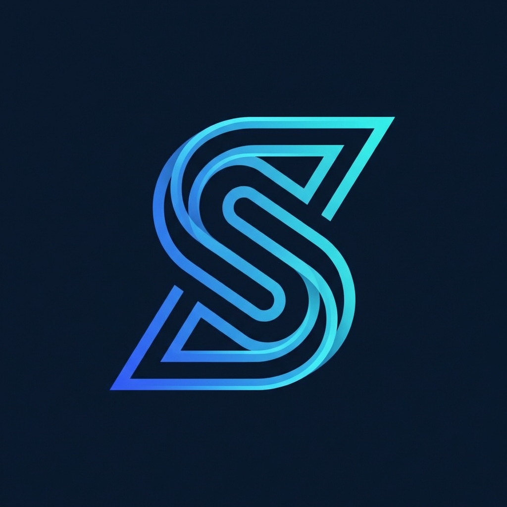

# StreamPay

<p align="center">
  
</p>

<p align="center">
  <strong>Payment Channels for AI Agents on Cronos EVM</strong>
</p>

<p align="center">
  <a href="#quick-start">Quick Start</a> •
  <a href="#how-it-works">How It Works</a> •
  <a href="#demo">Demo</a> •
  <a href="#deployed-contracts">Contracts</a>
</p>

---

## Overview

StreamPay is a trust-minimized payment channel extension for the [x402 protocol](https://github.com/coinbase/x402), purpose-built for AI agents on Cronos EVM. The standard x402 "exact" scheme requires one blockchain transaction per API call—creating massive overhead for AI agents making hundreds of calls per session. StreamPay solves this by enabling agents to deposit funds once into an escrow contract, make unlimited API calls off-chain with EIP-712 signatures, and settle everything with a single transaction using Merkle proofs.

The system achieves **99% gas savings** while remaining fully trustless. Every API call is cryptographically signed by the agent and batched into a Merkle tree. During settlement, only the Merkle root goes on-chain. Facilitators must first deposit a $100 bond before they can facilitate channels. If disputes arise, the facilitator can submit the agent's signatures and Merkle proofs to the smart contract for on-chain verification—making it impossible for either party to cheat. Agents who underpay face a 10% penalty; facilitators who overclaim have their bonds slashed.

This creates a Nash equilibrium where honesty is always the optimal strategy, enabling institutional-grade, autonomous payment flows for AI agents without trust assumptions.

---

## Deployed Contracts (Cronos Testnet)

| Contract | Address | Explorer |
|----------|---------|----------|
| **ChannelEscrow** | `0x00d09A4218759Ba9e4f00aE50c27407AEf4B5B26` | [View](https://explorer.cronos.org/testnet/address/0x00d09A4218759Ba9e4f00aE50c27407AEf4B5B26) |
| **MockUSDC** | `0xAdeeb27C383f8637482c5054dBdD7eA2C91B8b5A` | [View](https://explorer.cronos.org/testnet/address/0xAdeeb27C383f8637482c5054dBdD7eA2C91B8b5A) |

> **Network:** Cronos Testnet (Chain ID: 338)

---

## Key Features

| Feature | Description |
|---------|-------------|
| **99% Gas Savings** | Batch 1000 calls into 2 transactions |
| **x402 Compliant** | HTTP 402, X-Payment headers, EIP-712 |
| **Merkle Proofs** | Compress all calls into one root hash |
| **EIP-712 Signatures** | Cryptographic authorization per call |
| **Dispute Resolution** | On-chain signature verification |
| **Facilitator Bonds** | $100 stake, slashed for fraud |

---

## How It Works

```
┌─────────────────────────────────────────────────────────────────────────┐
│                        STREAMPAY PROTOCOL FLOW                          │
├─────────────────────────────────────────────────────────────────────────┤
│                                                                         │
│  0. FACILITATOR     Facilitator deposits $100 bond (one-time)          │
│       ↓             Bond is slashed if facilitator cheats              │
│  1. AGENT DEPOSIT   Agent deposits $10 into escrow contract            │
│       ↓                                                                 │
│  2. API CALLS       Makes 100+ calls, each signed with EIP-712         │
│       ↓             (off-chain, no transactions)                        │
│  3. MERKLE TREE     All calls batched into one root hash               │
│       ↓                                                                 │
│  4. SETTLE          Submit root + total cost, settle in 1 tx           │
│                                                                         │
│  IF DISPUTE:        Facilitator submits signatures + Merkle proofs     │
│                     Contract verifies → Liars get punished             │
│                                                                         │
└─────────────────────────────────────────────────────────────────────────┘
```

---

## Quick Start

### Prerequisites

- [Foundry](https://book.getfoundry.sh/getting-started/installation)
- [Node.js](https://nodejs.org/) >= 18
- [pnpm](https://pnpm.io/)

### Install & Build

```bash
pnpm install
pnpm build
pnpm contracts:build
```

### Run Tests

```bash
pnpm contracts:test
```

---

## Demo

Run the full x402 protocol flow with automatic blockchain setup:

```bash
# Happy path (honest settlement)
pnpm e2e:x402-flow

# Agent tries to underpay → Gets penalized
pnpm e2e:x402-dispute

# Facilitator overclaims → Bond slashed
pnpm e2e:x402-facilitator-dispute

# Both parties lie → Both punished
pnpm e2e:x402-both-lie
```

---

## Project Structure

```
streampay/
├── contracts/              # Solidity smart contracts (Foundry)
│   └── src/
│       ├── ChannelEscrow.sol    # Main escrow with disputes
│       ├── MerkleVerifier.sol   # On-chain proof verification
│       └── libraries/           # ECDSA, SafeERC20
├── packages/
│   ├── x402/              # x402 protocol types
│   ├── merkle/            # Merkle tree library
│   ├── server/            # x402-compliant API server
│   ├── client/            # AI agent SDK
│   └── demo/              # Demo scripts
└── scripts/               # Automation scripts
```

---

## Smart Contract Functions

| Function | Description |
|----------|-------------|
| `deposit()` | Open channel with facilitator |
| `initiateClose()` | Start settlement with Merkle root |
| `facilitatorConfirm()` | Facilitator agrees to settlement |
| `dispute()` | Agent disputes facilitator's claim |
| `facilitatorDispute()` | Facilitator disputes underpayment |
| `submitProofs()` | Submit Merkle proofs + signatures |
| `finalizeDispute()` | Resolve dispute based on proofs |

---

## Gas Comparison

| Scheme | 1000 Calls | Gas | Savings |
|--------|------------|-----|---------|
| x402 Exact | 1000 tx | ~50M | — |
| StreamPay | 2 tx | ~200K | **99.6%** |

---

## Tech Stack

- **Blockchain:** Cronos EVM (Testnet/Mainnet)
- **Smart Contracts:** Solidity 0.8.20, Foundry
- **Client SDK:** TypeScript, Viem
- **Cryptography:** EIP-712, ECDSA, Merkle Trees
- **Server:** Express.js with x402 middleware

---

## x402 Compliance

| Requirement | Status |
|-------------|--------|
| HTTP 402 Payment Required | ✅ |
| X-Payment-Required header | ✅ |
| X-Payment header (EIP-712) | ✅ |
| X-Payment-Receipt header | ✅ |
| On-chain verification | ✅ |
| Replay protection (nonce) | ✅ |

---

## License

Apache-2.0

---

## Links

- **x402 Protocol:** [github.com/coinbase/x402](https://github.com/coinbase/x402)
- **Cronos Docs:** [docs.cronos.org](https://docs.cronos.org/)
- **EIP-712:** [eips.ethereum.org/EIPS/eip-712](https://eips.ethereum.org/EIPS/eip-712)
